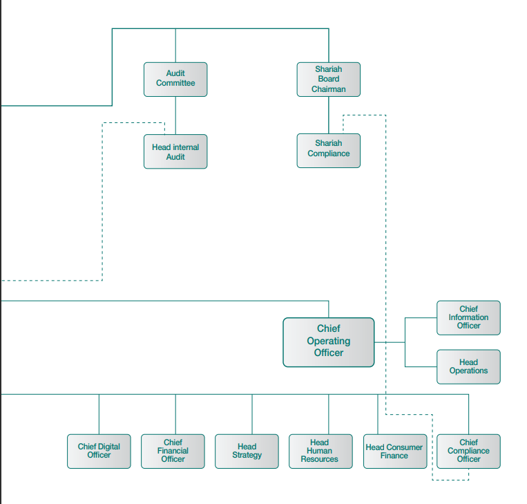
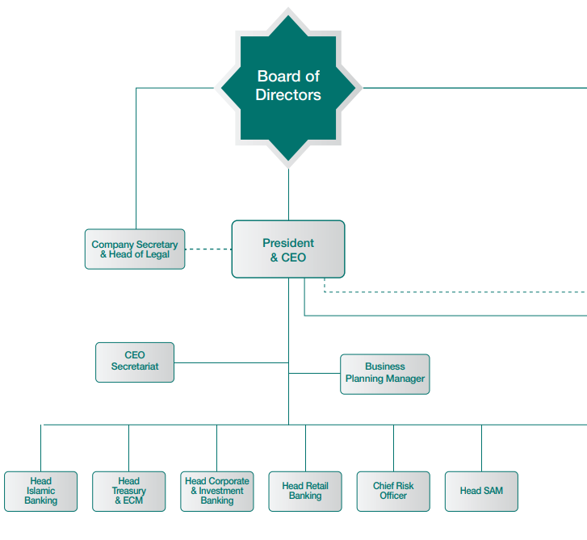
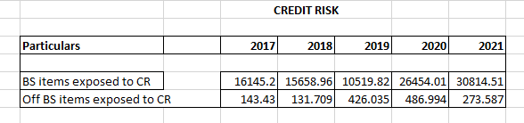
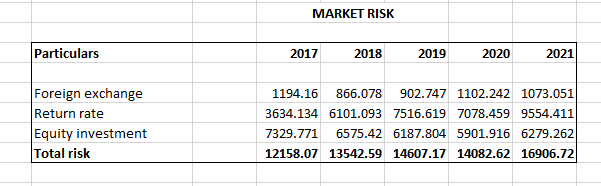
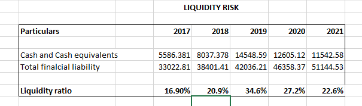
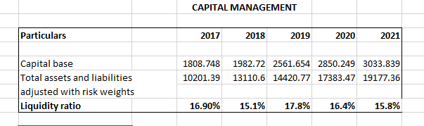

**A Due diligent of an Islamic
Banking or Islamic Window**

**ABSTRACT**

Faisal Islamic Bank of Egypt SAE is an Egyptian \"shariah-compliant\"
financial company established in Cairo with a market value of \$402
million as of the end of September 2016. It is a joint-stock firm that
was founded in 1977 but began operations in 1979. In this assignment we
will clearly discuss the Business model of the bank and the products and
services which is offered by the bank and their potentials. We will
completely analyse the Risk factors and the management steps carried out
by the bank in details. In addition to that the corporate governance and
the Sharia governance of the bank is detailed and discussed. Finally,
the regulatory framework and the rules of the jurisdiction in which the
bank is operating is also explained.

**1 Islamic bank**

**Principals:**

-   Usury (Riba) is forbidden in financial dealings. Giving or receiving
    interest or providing a loan containing interest is against the law.

-   prohibition of all monopolies and hoarding practices.

-   directing financial resources towards sectors of the economy that
    are helpful to or useful to society.

-   Investment of money in illegal enterprises, such as the sale of
    alcohol or pork, is forbidden. - achieving social solidarity through
    reviving Zakat (lawful almsgiving).

-   complete openness in all activities.

**1.1 Introduction:**

**1.1.1 Incorporation & History:**

The first Islamic and commercial bank in Egypt is called Faisal Islamic
Bank of Egypt (FIBE). On July 5, 1979, the Bank\'s operations were
formally started. However, the Bank\'s founders met over five years
prior and decided to build a bank in Egypt that would operate in line
with Islamic law in order to serve as an example for Islamic banking
worldwide. In front of a number of Egyptian leaders and officials, the
Royal Highness Prince Mohammed Al-Faisal Aal-Saoud\*, Chairman of the
Board of Directors, presented the idea. Both the general population and
government authorities largely welcomed and supported the concept. The
Bank was established in accordance with Law No. 48 of 1977, which was
later approved by the Egyptian Parliament. The Bank was granted a
licence as an economic and social organization functioning in accordance
with Islamic Sharia principles and took the shape of an Egyptian
Joint-Stock Company. Law No. 142 of 1981 changed the articles of
incorporation, and Law No. 97 of 1996 amended them once more. By the end
of 2019, the Bank\'s capital had grown progressively to \$ 506.2 million
in issued and entirely paid-up capital to \$ one billion as authorised
capital due to high demand for its shares which was five times greater
than its subscription shares. Over 1.7 million accounts were in total
under the bank\'s management for his client. By the end of 2020, the
Bank\'s total assets had grown to EGP 107.8 billion. As late His Royal
Highness Prince Mohammed Al-Faisal Aal Saoud\'s successor, His Royal
Highness Prince Amr Mohammed Al-Faisal Aal-Saoud currently serves as
chairman of the board of directors. The bank has 38 branches and has its
main office at 3, 26th July St., Cairo. It offers both retail &
corporate banking services, as well as investment activities, in the
Arab Republic in Egypt and overseas.

**1.1.2 Vision:**

To be the best bank in providing Islamic services and products to our
customers and correspondents, as well as achieving a positive and
sustainable development in the Bank's position on regional and
international levels.

**2 BUSINESS MODEL**

**3 Products and Services:**

**3.1 The Local Market:**

**1. Musharaka (partnership):**

The lawful alternative to the interest-bearing credit system used by
traditional banks is profit and loss sharing. The Bank takes part in all
commercial, industrial, agricultural, and service operations with its
customers. The bank & its clients have a partnership rather than a
creditor-debtor relationship. Each party contributes a known share of
the capital, such that the deal\'s profit or loss is distributed
proportionally to each party\'s stake. Profit is distributed as a
specific percentage on net profit is deducted from the client in
exchange for management, & the remaining profit gets distributed
pro-rata to the two parties\' shares.

**2 Legitimate Mudaraba:**

-   The bank (as the capital source) offers the money in this sort of
    Mudaraba, and the business owner (Mudareb) invests it through legal
    channels.

-   Profit distribution is decided by previously agreed-upon
    percentages. In the event of a loss, the money owner maintains total
    accountability, whereas the (Mudareb) loses just his effort until it
    is proven the (Mudareb) was irresponsible or broke the Mudaraba
    rules, in which case he will be held liable for the loss.

**3 Murabaha sale:**

-   Murabaha sales are one of the legal forms of sales in which the
    client requests that the bank purchase a specific commodity while
    specifying its requirements.

-   The whole cost associated with the commodity is calculated in
    detail, including the purchase price, customs duties, and costs.

-   The two parties reach an agreement on the location and terms of
    delivery of the acquired commodity, in addition to the terms of
    repayment of the financial institution\'s dues.

**4 Salam sale (forward sale):**

-   Salam sale is the purchase of a commodity that is not in stock at
    the time of the contract. In this case, the buyer pays until the
    product on the spot, yet delivery is delayed by an agreed-upon
    duration.

-   This instrument offers manufacturers, producers, and farmers with
    advance financing for production expenses as well as the liquidity
    required for operations.

-   The Bank agrees with manufacturers or suppliers to acquire items on
    a spot-payment basis with a forward delivery date. The bank then
    sells these commodities in the market, either directly or through
    agents, to Murabaha clients.

**5. Ijara (service leasing):**

-   It entails selling a product or service for the purpose of
    utilization, in exchange for the buyer paying its cost in full or in
    instalments according to agreed-upon conditions, along with the
    possibility of selling that service to another individual (the
    customer) by the financial institution (the lessee) for an
    alternative rental value and payment terms.

-   In practise, the bank purchases numerous services from its lessors
    by purchasing their usury rights, such as: specialised service
    companies such as airlines, travel agencies, colleges, universities,
    along with hospitals, for a set amount of funds, then selling the
    license to its buyers through parallel leasing agreements for a
    deferred appreciate or instalments with a suitable profit margin.

**6. Istissnaa (Manufacturing sale):**

-   It is a contract that allows for the purchase of any non-available
    commodity or piece of equipment on the spot. The maker agrees to
    deliver the commodity or equipment in accordance with the
    agreed-upon specifications, price, and delivery date. As with the
    Salam sale, there is no need for immediate payment.

-   This sort of sale covers all industrial goods, conversion
    industries, and mining which will be utilized in any part of the
    manufacturing process, beginning with the production of windows,
    doors, automobiles, ships, and even airplanes.

**3.2 Foreign Investment:**

**Short-term operations**

-   Murabaha in commodities and minerals

-   Buying and selling currencies - currency exchange system

**Medium - term operations**

-   Foreign trade operations

-   Leasing operations and real-estate investments

-   Real estate operations

**Long - term operations**

-   Islamic Portfolios

-   Islamic Mutual Funds

-   Islamic Mudaraba operations

**4 Risk Management:**

**4.1 Financial Risk Management:**

The Risk Department controls certain risks in accordance with the Board
of Directors policy. The risk department identifies, evaluates, and
controls financial risks in collaboration with all of the bank\'s
different operating departments. The Board of Directors develops written
risk management policies and also provides formal guidelines over
specific risk areas such as liquidity danger, return on investment risk,
foreign exchange rate risk, and equity investments risk. The risk
department is thereafter in charge of conducting periodic risk
assessments.

**4.1.1 Credit Risk:**

This risk manifests itself mostly in lending and investment activity.
Off-balance-sheet financial instruments, such as lending obligations,
also carry this risk.

The process of managing and controlling credit risk is centralized at
the credit risk team\'s leadership at the credit risk department, which
prepares reports. Submit to the bank\'s Board of Directors, upper
management, and head units.

The following three criteria must be examined in order to estimate
credit risk related to funds and client facilities:

-   Probability of a customer or a third party failing to fulfil
    contractual obligations.

-   The current state and potential future progress demonstrate default
    vulnerability.

-   The loss resulted in a default.

**4.1.2 Market risk:**

Faisal Bank is vulnerable to market risks such as fluctuations in fair
value or cash flows in the future caused by changes in market rates.
Market risks are posed by open positions of Return rates, currency, and
stock instruments are all vulnerable. Market public and special
movements, as well as levels of sensitivity to market rates or prices,
such as return rates Exchange rates and stock instruments are examples
of financial instruments.

-   Foreign currency threat: The institution is vulnerable to currency
    fluctuations. variations in foreign currency rates of exchange and
    their implications influence on the financial condition and cash
    flows. The Board of Directors decided on foreign exchange limits
    based on total value. currencies at the end of the working day for
    each position and during the day, they are observed on a regular
    basis.

-   Return rate risk: The committee of governors establishes limits on
    the amount of difference in return rate re-pricing which the bank
    may employ.

**4.1.3 Liquidity Risk:**

Liquidity risk arises when a bank has difficulty honouring its financial
obligations when they become due and replacing funds once they are
withdrawn. Failure to meet responsibilities for repaying depositors and
fulfil finance commitments could be the result.

The Bank\'s Finance Department manages the bank\'s financial risk by
maintaining a portfolio that includes highly marketable assets that may
be easily sold in the case of an unexpected disruption in cash flows.

Daily funding is handled by keeping an eye on future financial flows to
guarantee that all requirements are met. This includes replenishing cash
as it becomes due or is borrowed by consumers. In order to attain this
purpose, the Bank maintains a strong presence in global money markets.

**4.1.4 Capital Management:**

Faisal Bank manages capital in the following ways: - To meet capital
legal obligations in the Arab Republic of Egypt and other states where
the bank\'s branches operate.

To protect the bank\'s capacity to operate as a going concern in order
to continue providing returns to shareholders as well as other parties
engaging with the bank.

To maintain an adequate capital basis that will support the company\'s
growth.

The bank\'s management monitors capital adequacy & the use of the
required capital on a daily basis in accordance with the requirements of
the regulatory body (CBE). Using procedures based on the Basel Banking
Supervisory Committee\'s guidelines. The necessary data, in addition to
deposits made to the CBE, are submitted quarterly.

The CBE mandates the bank to: - Maintain a minimum of EGP 500 million in
issued and paid-up capital; and - Maintain a proportion of 10% or
greater between capitalization and risk-weighted assets & contingent
liabilities.

**5 Corporate Governance:**

**The General Assembly:**

The Chairman of the Board of Directors, or the Governor in the absence
of the Chairman, preside over the General Assembly, which is made up of
all Shareholders. The General Assembly sets the date of its regular
meeting three months after the conclusion of the fiscal year. The board
of directors, the auditor, or a number of shareholders holding at least
ten percent (10%) of the capital may request that the General Assembly
hold an extraordinary meeting. For an ordinary meeting to be valid, at
least (51%) of the bank\'s capital must be present, however for an
extraordinary meeting, at least (75%) must be present. A second regular
meeting is called if the minimal limit is not reached in the first one.
In contrast to the second extraordinary meeting, which requires at least
25% of the shares, the second ordinary meeting is regarded as valid
regardless of the number of shares represented. The majority of the
attendees\' votes determine the choices of the regular General Assembly.
The majority (75%) of the shares that are represented at the meeting
must vote to approve the decisions in the extra-ordinary meeting. In all
cases, the decisions are binding on all shareholders, including those
who are present but choose not to vote.

**The Board of Directors and the Governor:**

The Board of Directors has all the authority necessary to govern the
bank and is in charge of doing so. A chairperson is chosen from among
the Board of Directors\' maximum (15) members. These members or others
have been selected to act as the bank\'s governor. In his absence, the
Governor assumes the role of Chairman of the Board of Directors,
executes board decisions, oversees all activities, and is directly
accountable for all activities brought before the Board. The directors
are chosen by the Board, which also establishes the rules controlling
their powers. Every three years, the General Assembly chooses the
shareholders\' representatives to the Board of Directors.

**Religious Supervisory Board:**

Dr. Nasr Farid Mohammad Wassel Chairman

Dr. Ali Gomaa Mohammad Abdulwahab Deputy Chairman

Dr. Hamdi Sobh Taha Dawood Member

Dr. Abdelhady Mohammad Abdelhady Zarea Member

**6 Sharia governance:**

Sharia governance, also referred to as Islamic governance and Sharia
compliance, describes the structure and procedures that are in place to
ensure that an organization, financial institution, and business follows
Islamic values and Sharia law. Sharia governance is especially crucial
for Islamic financial organizations and corporations, but it can apply
to any organization that wants to follow Islamic legal and moral
principles.

Some of the key components and principles of Sharia governance

**Sharia Supervisory Board (SSB):**

Islamic financial organizations often have a Sharia Board of Directors
or Shariah Advisory Board comprised of Islamic academics and Islamic
finance specialists. This board is in charge of verifying that the
institution\'s operations and financial products adhere to Sharia
standards. They give advice, review transactions, and make decisions on
the legality of specific activities or items.

**Compliance and Audit Functions:**

To guarantee that their activities are in accordance with Sharia
standards, Islamic organisations frequently have specialized compliance
and audit responsibilities. These operations monitor activities,
actions, and goods in order to identify and correct any potential
infractions.

**Documentation and Contracts:**

Sharia-compliant agreements and contracts must be properly designed to
guarantee that Islamic standards are followed. Interest (riba),
uncertainty (gharar), & gambling (maysir) comprise the forbade aspects
of these contracts.

**Risk Management:**

Sharia-compliant risk management practises must be implemented by
Islamic financial organisations. Risk-sharing arrangements & the
avoidance of undue uncertainty and speculation are examples of this.

**Transparency and Disclosure:**

In Sharia administration, transparency is critical. Organisations are
expected to offer straightforward and precise data on Sharia compliance
regarding their products and activities to all stakeholders,
particularly customers and investors.

**Ethical Standards:**

In their business practises, Islamic organisations are supposed to
adhere to strict ethical standards. This includes avoiding participation
in companies involved in drugs, gambling, pork, and various other
illegal activities.

**Charitable Obligations:**

Fulfilling philanthropic requirements, such as donating a percentage of
revenues to charity (zakat) and managing company in a manner that
benefits society (maslaha), is part of Sharia governance.

**Regular Audits and Reviews:**

Sharia governance systems involve audits and assessments of the
company\'s operations as well as financial products on a regular basis
to ensure continuous Sharia compliance.

**7 Regulatory Frameworks:**

FIBE was created under special Law No. 48 of 1977 and its revisions, the
most recent of which is Law No. 97 of 1996; the bank is registered with
the Central Bank of Egypt as a bank for commercial purposes pursuant to
the terms of CBE and banking system Law No. 88 of 2003. The bank is
additionally subject to supervision by the Central Bank of Egypt, and it
is dedicated to following all of its directives, as well as delivering
the obligatory monthly reports to those responsible for overseeing
banks. The Central Bank also inspects and approves the bank\'s financial
statements on a regular basis. Furthermore, all of the bank\'s
activities are overseen by the Religious Supervisory Board, which
approves all transactional agreements and reviews all actual executions
of these kinds of transactions. In addition, external auditors examine
the bank\'s financial statements and records.

**8 CONCLUSIONS:**

The Bank\'s efforts and financial policies implemented during FY 2021
resulted in a number of outcomes, the most notable of which was a total
balance sheet of EGP 131 billion and total revenues of EGP 11.3 billion.
These earnings enabled the bank to distribute returns to saving pool
customers at a mean annual percentage of 4.80% for General savings
accounts held in the native currency, 9.10% over three-year saving
documents, 8.73% for four-year conserving certificates, 9.65% to feed
\"Izdhar\" five-year avoiding certificates, 11.30% over \"Nam\'a\"
seven-year preserving certificates, as well as 1.65% for expenditure
accounts possessed in foreign currencies.

Concerning the Bank\'s various commitments, provisions have been made to
meet finance and investment risks as well as to cover current costs
(general and administrative costs, depreciation, lawful Zakat
(almsgiving) owing to the Bank\'s finances, and income taxes).

Following the fulfilment of the aforementioned promises, the total net
distributable income for FY 2021 is EGP 2.7 billion.

**Business Expenses:**

The net profit for the year amounts to EGP 2.7 billion. This profit was
generated by the following revenues and expenses, as shown in the income
statement:

**Revenue:**

During the reporting year, total revenues amounted bank EGP 11.3
billion.

**Expenses:**

Total expenses amounted to EGP 8.6 billion.

**Volume of Business and main activities:**

**The Bank's staff, Training and branches:**

The evolution of the bank\'s performance is intimately tied to human
resources. As a result, the Bank\'s top management has focused heavily
on its workers in order to improve their performance by offering them
with training programmes aimed at enhancing their technical expertise or
behavioural and managerial skills.

-   At a cost of EGP 8.3 million, 127 training programmes were delivered
    to 1102 employees, with 2065 training opportunities and 48369
    training hours.

**9 REFERENCES**

Abedifar, P., Molyneux, P. and Tarazi, A., 2013. Risk in Islamic
banking. *Review of finance*, *17*(6), pp.2035-2096.

Ariff, M., 1988. *Islamic banking*. Asian-Pacific Economic Literature
Vol. 2, No. 2 (September 1988), pp. 48-64.

Hassan, K. and Lewis, M. eds., 2009. *Handbook of Islamic banking*.
Edward Elgar Publishing.

Dorogovs, P., Solovjova, I. & Romanovs, A. New tendencies of management
and control of operational risk in financial institutions.

Procedia - Social and Behavioral Sciences, 2013, 99. pp. 911 -- 918.
\[2\] Dinu, A. M. Risk in financial transactions and financial risk
management Procedia. Social and Behavioral Sciences, 2014, 116. pp. 2458
-- 2461.

Islamic Financial Services Board. Guiding Principles of Risk Management
for Institutions (other than Insurance Institutions) offering only
Islamic Financial Services (IIFS), 2005, Available from:
http://www.ifsb.org/standard/ifsb1.pdf. (Accessed: 30th January 2016).

Iqbal, M. and Molyneux, P., 2016. *Thirty years of Islamic banking:
History, performance and prospects*. Springer.
